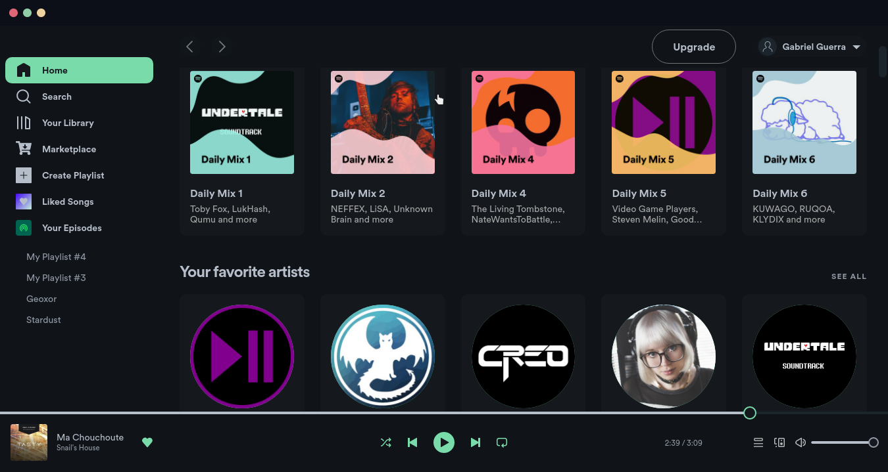

# [Decay](https://github.com/decaycs) For Spicetify

This is a port of decay for [spicetify](https://spicetify.app)

## Installation

First install spicetify and run `spicetify backup apply` (see the spicetify installation instructions).

> Also remember to set the appropiate permissions when installing spicetify

> Supposing that your spotify client is located under /usr/libexec/spotify and your root group is wheel

```sh
sudo chgrp wheel /usr/libexec/spotify
sudo chgrp wheel -R /usr/libexec/spotify/Apps
sudo chmod 775 /usr/libexec/spotify
sudo chmod 775 -R /usr/libexec/spotify/Apps
```

After installing spicetify you can start bootstrapping your config if there isn't some files inside `~/.config/spicetify`:

```sh
spicetify
```

> Running it with no flags just bootstraps your .config

Then clone the theme:

```sh
cd $HOME
git clone --depth=1 https://github.com/decaycs/decay-spicetify.git
cd decay-spicetify
```

Then copy the appropiate files inside the spicetify's config.

```sh
test -d $HOME/.config/spicetify/Themes || mkdir -p $HOME/.config/spicetify/Themes 
cp -r ./Themes/* ~/.config/spicetify/Themes
```

Then select your favorite theme:

> Replace `<theme>` with one of: `decay`, `dark-decay`, `light-decay` or `decayce`.

```sh
spicetify config current_theme <theme>
```

Then apply it!

```sh
spicetify apply
```

After that, open spotify and you'll see it with your theme applied :)

## Gallery





## Thanks to

- [AlphaTechnolog](https://github.com/AlphaTechnolog)
- [Spaxly](https://github.com/Spaxly) (for great help :>)

## Enjoy

That was all! Now enjoy with it, also, if you like decay, recommend us work to your friends :)
